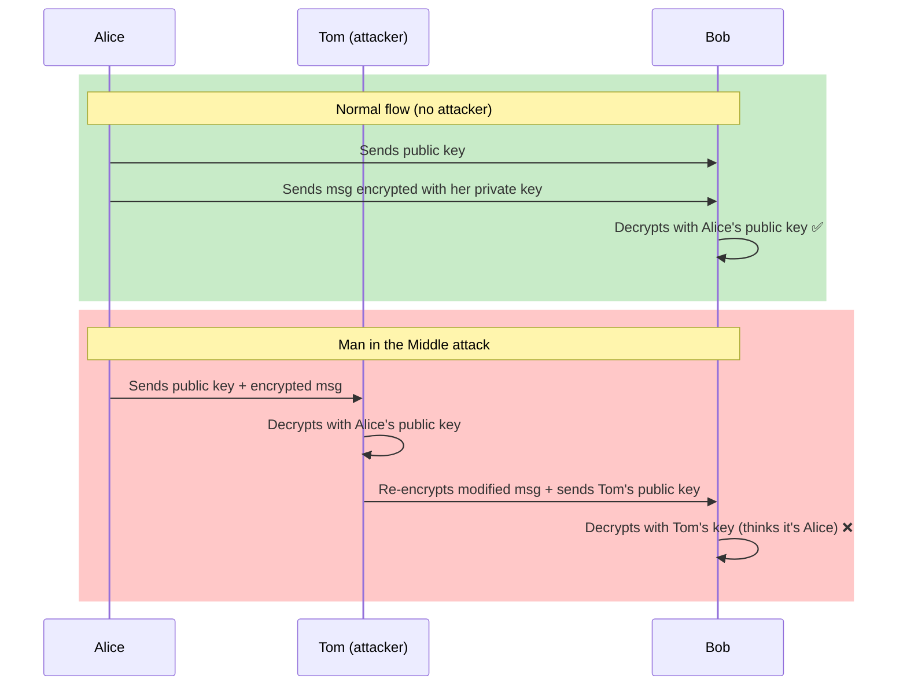
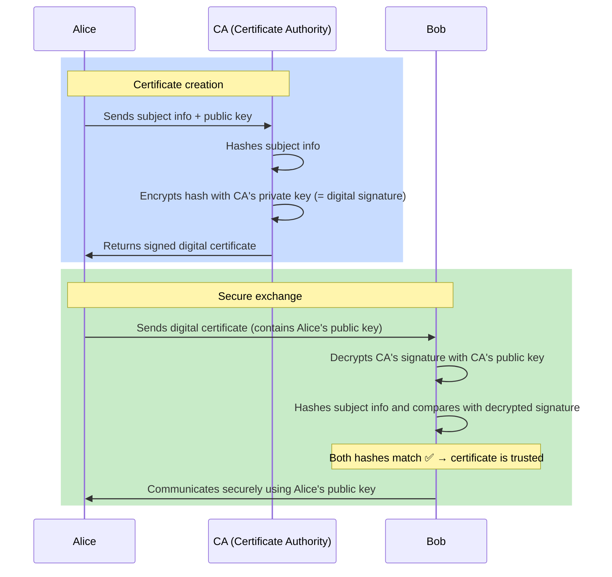

# Quick algorithm overview

## Hashing

One-way function (cannot be reversed)

Popular algorithms:
- **MD5** — 128-bit, fast but broken (collisions found), avoid for security
- **SHA-256** — 256-bit, widely used (TLS, git, Bitcoin)

## Encryption

### Symmetric encryption

Same key to encrypt and decrypt (fast as opposed to Asymmetric encryption)

Popular algorithms:
- **AES** — the standard (128/192/256-bit keys), used almost everywhere

### Asymmetric encryption

Key pair: one **private** (secret), one **public** (shared)
- Encrypt with public key → only private key can decrypt (confidentiality)
- Sign with private key → anyone with public key can verify (authentication)

Popular algorithms:
- **RSA** — the classic (2048/4096-bit keys)

# Digital Signatures

From my understanding, digital signatures are not so much signature than a "proof of integrity" of the associated content on which the signature was put.

You can also be sure that the msg was sent by the person who encrypted the msg (because that person owns the private key), but at this point you can't be sure the person is who he claims to be (this is why we use digital certificates).

# Digital Certificates

From my understanding, Digital Certificates look more like a signature as they prove that the person (or the domain) is who he claims he is because he previously declared himself to a CA which signed his identity fields.

## Problematic: **Alice** sent her public key to **Bob** but how can be sure absolutely sure that key is **Alice**'s?

- **Alice** sends her public key to **Bob**
- **Alice** encrypts a msg with her private key and sends it to **Bob**
- **Bob** is able to decrypt the msg thanks to the public key

> But how can we be sure there wasn't a Man in the Middle attack? How can **Bob** be sure?

- **Man in the Middle attack**:
	- Say **Tom** the bad guy is between **Alice** and **Bob** ("man in the middle"):
	- **Tom** intercepts **Alice**'s msg and has her public key
	- he decrypts **Alice**'s msg with her public key, modifies the content, then **signs the modified msg with his own private key** and sends it to **Bob** along with **his own public key** — pretending it's Alice's key pair entirely
	- **Bob** is then "cheated" in thinking he is receiving encrypted msgs from **Alice** when in reality it was malicious **Tom**

> **The fundamental problem is**: how can we be sure the public key decrypting the msg is **Alice**'s?

## Enter Digital Certificates

- **Alice** will send **Bob** her digital certificate
- that digital certificate:
	- associates **Alice**'s public key and her identity
	- it was issued by a CA (Certificate Authority)
- that digital certificate has 2 properties:
	- it proves **Alice** is who she claims to be
	- it is trusted because everybody trusts the CA who issued the certificate (think: like a government agency; your web navigator has a list of trusted CAs, organizations add their private CA)

## How to create a digital certificate

- give a lot of (verifiable) subject information (identity fields like Common Name, Organization, etc.)
- give your public key

## What happens when the CA creates the digital certificate

- they hash all the subject information using a hashing algorithm
- they encrypt this hash using the CA's private key => the CA adds a **digital signature** of the CA! this way he locks the content of Alice's identity fields

> So in the end:

1. the end-receiver **Bob** receives the certificate with the key
2. Assuming he trusts the CA (in other words the CA was installed in the machine's certificates and so he trusts the CA's public key)
3. **Bob** uses the CA's public key to check the CA's signature on the certificate
4. he then uses Alice's public key to exchange with her in an encrypted way

## How does the user validate the digital certificate?

- he uses the same hash algorithm to hash the subject information in the certificate
- he uses the CA's public key to decrypt the CA's signature on the certificate
	- if he can decrypt the signature, he knows the certificate is indeed the CA's
	- if he can't, the certificate is not trusted
- he then:
	- calculates the hash of the certificate's subject information
	- and compares it with the decrypted certificate's signature => if both hashes are the same: OK!

> **Note:** Hash verification is not the only validation step. In practice, the user also checks that the certificate hasn't **expired**, hasn't been **revoked** (via CRL or OCSP), and that the chain of trust goes all the way up to a **trusted root CA**.

## Learning resources

- https://www.youtube.com/watch?v=c-O-uMxTaEw&list=PL7d8iOq_0_CWAfs_z4oQnCuVc6yr7W5Fp&index=3
